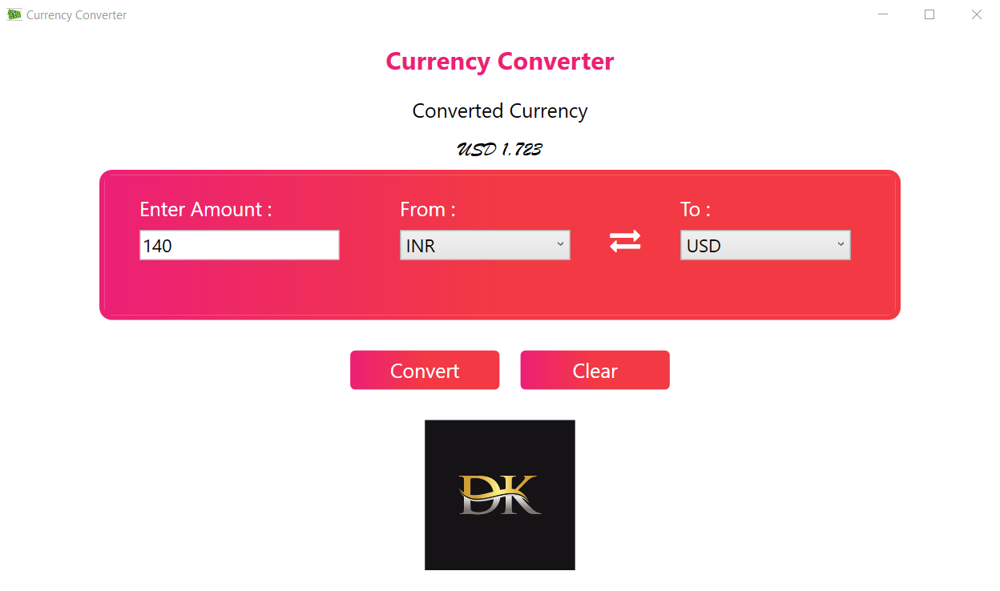

# Currency Converter Application
 
Get accurate and up-to-the-minute currency conversion rates for pair of currencies.
 
 

## DESCRIPTION
 1. A Currency Converter is a WPF application designed to convert one currency into another to check its corresponding value.
 2. It uses WPF which stands for Windows Presentation Foundation. And, the WPF is a UI framework that creates desktop client applications. Also, it is a part of .NET.
 3. It uses API request to world wide web through which current exchange rates are evaluated.

## INSTALLATION
```console
Run setup.exe to install the application.
```

## BUILD: If you want to make changes feel free to do so
```console 
Open CurrencyConverter_static1.sln file in Microsoft Visual Studio
Click on start
```
## TECHNOLOGIES
|Technologies|
|------|
|C#|
|WPF (Windows Presentation Form)|
|XAML|
|DotNet|
|API - https://exchangeratesapi.io|


 
 
 
 
 